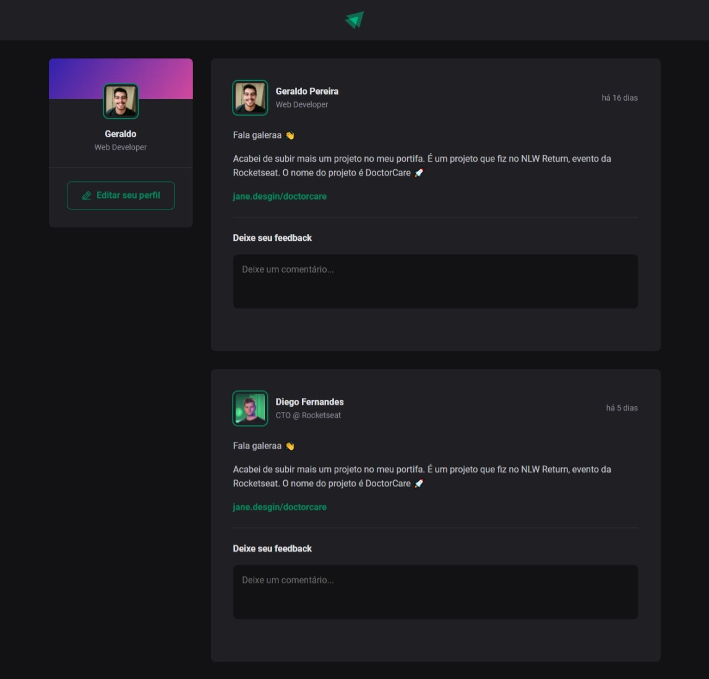

# Ignite Feed

## Projeto desenvolvido durante o curso Ignite de Reactjs - Rocketseat

## Projeto




# Install

Clone this repository and install it dependencies with this command:
```sh
$ npm install
```
Run the application with npm run dev command, it will start the app:
```sh
$ npm run dev
```

